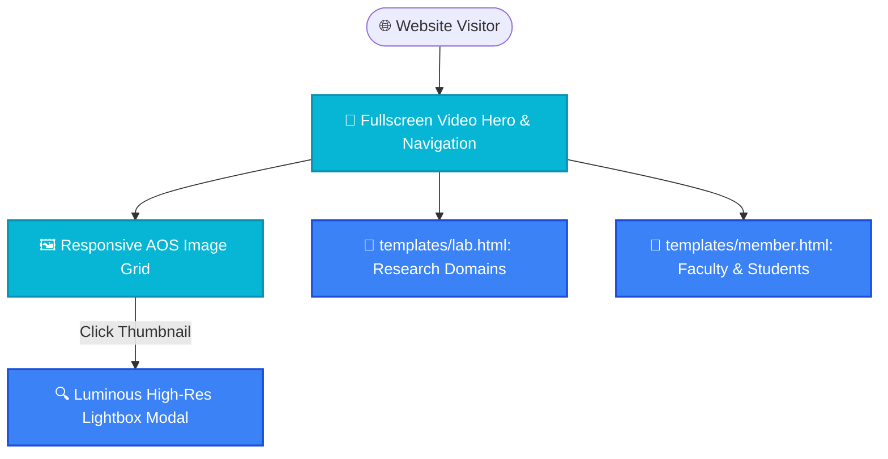

<p align="center">
  
</p>

<h1 align="center">🏛️ Academic Laboratory Website</h1>

<p align="center">
  <strong>Modern, Responsive Scientific Laboratory Portal Featuring Video Hero, AOS Scroll Dynamics, & Luminous Gallery.</strong>
</p>

<p align="center">
  <a href="#-overview">Overview</a> •
  <a href="#-features">Features</a> •
  <a href="#-code-architecture">Code Architecture</a> •
  <a href="#-system-structure">System Structure</a> •
  <a href="#-project-structure">Structure</a> •
  <a href="#-quick-start">Quick Start</a> •
  <a href="#-license">License</a>
</p>

<p align="center">
  
  
  
  
  
  
</p>

---

## 📌 Overview

A fast, responsive, and visually dynamic academic laboratory website built with modern HTML5, CSS3, and JavaScript. Designed for scientific research groups and universities, it features a fullscreen video hero section, an Animate-On-Scroll (AOS) gallery with responsive `srcset` multi-resolution images, full-resolution Luminous Lightbox previews, and dedicated sub-pages for laboratory themes (`templates/lab.html`) and researcher profiles (`templates/member.html`).

---

## ✨ Features (Key Outcomes & Capabilities)

| Icon | Feature | Outcome & Real Proof |
| :---: | :--- | :--- |
| 🎥 | **Fullscreen Video Hero** | HTML5 autoplay looped video banner (`video1.mp4`) with poster fallback (`hero.jpg`) and typographic overlay |
| 🖼️ | **Responsive Image Grid (`srcset`)** | Multi-resolution responsive images (400w, 800w, 1600w) delivering optimal bandwidth on mobile and 4K displays |
| ✨ | **AOS Scroll Motion** | Smooth scroll-triggered fade-in animations (`data-aos="fade-up"`) across the laboratory research gallery |
| 🔍 | **Luminous Lightbox Integration** | Seamless click-to-zoom high-resolution lightbox modal without leaving the page |
| 👥 | **Dedicated Sub-Page Architecture** | Modular templates for laboratory research pillars (`templates/lab.html`) and faculty/member directory (`templates/member.html`) |

---

## 🔬 Code Architecture & Implementation

### 📐 Front-End Stack & Libraries (`index.html`, `css/style.css`, `js/script.js`)
- **CSS Reset & Typography**: Leverages `destyle.css@1.0.5` for cross-browser consistency and Google Fonts (`Bree Serif`) for classic academic elegance.
- **Dynamic Scroll Animations**: Initialized via AOS (`AOS.init()`) with `data-aos="fade-up"` attributes attached to grid items.
- **Lightbox Preview Engine**: Powered by `Luminous` (`new LuminousGallery(document.querySelectorAll('.grid-gallery'))`), dynamically binding high-resolution anchors (`href="images/*-1600.jpeg"`) to in-browser popups.
- **Responsive Layout**: CSS Grid system (`.grid`) with adaptive `repeat(auto-fit, minmax(...))` scaling from single-column mobile views to multi-column desktop displays.

---

## 📊 System Structure



---

## 📁 Project Structure

```bash
laboratory-website/
├── 📁 assets/                 # High-resolution SVG banners
│   └── 🎨 hero.svg
├── 📁 css/                    # Custom styling & typography
│   └── 📄 style.css
├── 📁 js/                     # Interactivity, Lightbox & AOS initialization
│   ├── 📄 script.js
│   └── 📄 jquery-3.7.1.min.js
├── 📁 images/                 # Multi-resolution images (400w, 800w, 1600w) & video
├── 📁 templates/              # Sub-pages for lab research & members
│   ├── 📄 lab.html
│   └── 📄 member.html
├── 📄 index.html              # Main laboratory portal entry
└── 📄 README.md               # Complete documentation
```

---

## 🚀 Quick Start

### 1. View Locally
Open `index.html` directly in any web browser, or launch with a lightweight static server:

```bash
# Python 3:
python -m http.server 8080

# Or Node.js:
npx serve .
```

### 2. Deploy to GitHub Pages / Vercel
Push to GitHub and enable **GitHub Pages** (`Settings -> Pages -> Deploy from branch: main`) for instant zero-configuration global hosting.

---

<p align="center">
  Released under the <a href="LICENSE">MIT License</a>. Crafted with ❤️ by <a href="https://github.com/LoNebula">LoNebula</a>
</p>