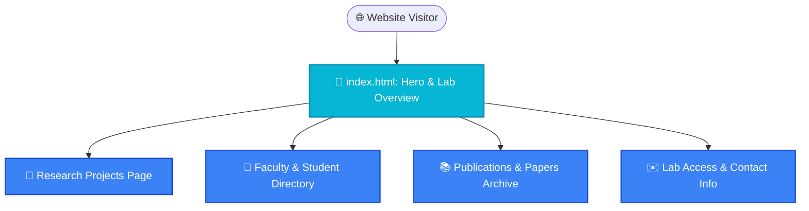

<p align="center">
  
</p>

<h1 align="center">🏛️ Academic Laboratory Website</h1>

<p align="center">
  <strong>A modern, responsive academic laboratory portal for scientific research, member profiles, and publication archives.</strong>
</p>

<p align="center">
  <a href="#-features">Features</a> •
  <a href="#-architecture">Architecture</a> •
  <a href="#-project-structure">Structure</a> •
  <a href="#-quick-start">Quick Start</a> •
  <a href="#-license">License</a>
</p>

<p align="center">
  
  
  
  
  
</p>

---

## ✨ Features (Key Outcomes & Capabilities)

| Icon | Feature | Outcome & Real Proof |
| :---: | :--- | :--- |
| 🔬 | **Research Project Showcase** | Dedicated research theme presentations with high-resolution imagery and methodology summaries |
| 👥 | **Member & Alumni Directory** | Structured faculty, researcher, student profiles with research interests and social links |
| 📚 | **Publication & Citation Archive** | Chronological and categorized listing of conference papers, journal articles, and preprints |
| 📱 | **Fluid Mobile-First Design** | 100% responsive CSS grid and flexbox layouts optimized for mobile, tablet, and widescreen |
| ⚡ | **Zero-Dependency Static Fast Load** | Pure HTML/CSS/JS architecture for instant edge delivery and GitHub Pages / Netlify compatibility |

---

## 📊 Architecture & Structure



---

## 📁 Project Structure

```bash
laboratory-website/
├── 📁 assets/                 # High-resolution SVG banners & media
│   └── 🎨 hero.svg
├── 📁 css/                    # Modular stylesheets (layout, theme, typography)
├── 📁 js/                     # Client-side interactions & navigation
├── 📁 images/                 # Lab photos, member avatars, & diagrams
├── 📁 templates/              # Reusable page templates
├── 📄 index.html              # Main portal entry point
└── 📄 README.md               # Project documentation
```

---

## 🚀 Quick Start

### 1. View Locally
Simply open `index.html` in any modern web browser, or serve via a local static server:

```bash
# Python 3 built-in HTTP server:
python -m http.server 8080

# Or Node.js serve:
npx serve .
```

### 2. Deploy to GitHub Pages / Vercel
Push to GitHub and enable **GitHub Pages** in repository settings (`Settings -> Pages -> Deploy from branch: main`), or import directly into Vercel / Netlify for instant zero-configuration deployment.

---

## 💡 Customization Guide

> [!TIP]
> To update research members or publications, edit the structured HTML sections in `index.html` or the respective page templates in `templates/`.

---

<p align="center">
  Released under the <a href="LICENSE">MIT License</a>. Made with ❤️ by <a href="https://github.com/LoNebula">LoNebula</a>
</p>